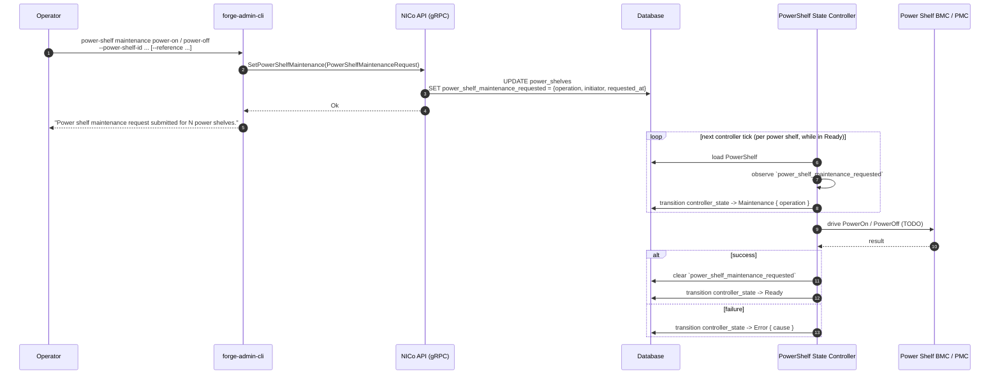
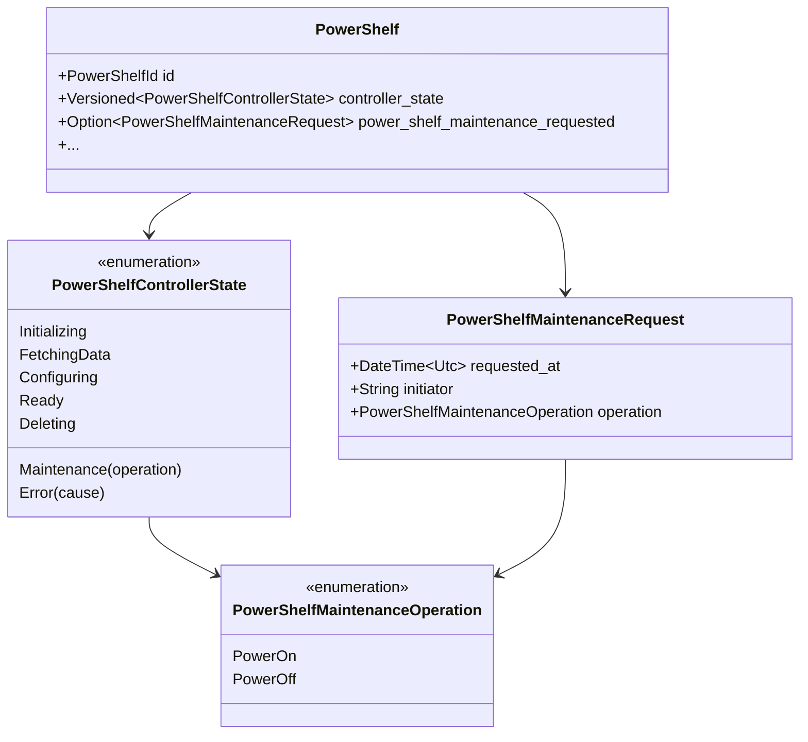

# Power Shelf State Diagram

This document describes the Finite State Machine (FSM) for Power Shelves in
NICo: lifecycle from creation through initialization, ready, the OnDemand
maintenance operations (PowerOn / PowerOff), and deletion. It also covers the
operator-facing interfaces (CLI / gRPC) used to drive the OnDemand operations.

## High-Level Overview

The main flow shows the primary states and transitions:

```mermaid
stateDiagram-v2
    state "Initializing" as Initializing
    state "FetchingData" as FetchingData
    state "Configuring" as Configuring
    state "Ready" as Ready
    state "Maintenance (PowerOn / PowerOff)" as Maintenance
    state "Error" as Error
    state "Deleting" as Deleting

    [*] --> Initializing : Power shelf created

    Initializing --> FetchingData : controller processes power shelf
    FetchingData --> Configuring : data fetched
    Configuring --> Ready : configuration complete

    Ready --> Deleting : marked for deletion
    Ready --> Maintenance : OnDemand maintenance requested (PowerOn / PowerOff)

    Maintenance --> Ready : operation complete; maintenance request cleared
    Maintenance --> Error : operation failed

    Error --> Deleting : marked for deletion
    Error --> Maintenance : OnDemand maintenance requested (PowerOn / PowerOff)

    Deleting --> [*] : final delete
```



## States

| State | Description |
|-------|-------------|
| **Initializing** | Power shelf record exists in NICo; awaiting first controller tick. |
| **FetchingData** | Controller is fetching power shelf data from the BMC / PMC. |
| **Configuring** | Power shelf is being configured (credentials, monitoring, etc.). |
| **Ready** | Power shelf is ready. From here it can be deleted or driven into `Maintenance` by an OnDemand request. |
| **Maintenance** | Power shelf is executing an operator-requested maintenance operation. Sub-states (carried in the state variant as `operation`): `PowerOn`, `PowerOff`. |
| **Error** | Power shelf is in error (e.g. maintenance operation failed). Can transition to `Deleting` if marked for deletion, or to `Maintenance` if an OnDemand maintenance request is posted; otherwise waits for manual intervention. |
| **Deleting** | Power shelf is being removed; ends in final delete (terminal). |

## Transitions (by trigger)

| From | To | Trigger / Condition |
|------|-----|----------------------|
| *(create)* | Initializing | Power shelf created |
| Initializing | FetchingData | Controller processes power shelf |
| FetchingData | Configuring | Data fetch complete |
| Configuring | Ready | Configuration complete |
| Ready | Deleting | `deleted` set (marked for deletion) |
| Ready | Maintenance `{ PowerOn }` | `power_shelf_maintenance_requested.operation == PowerOn` |
| Ready | Maintenance `{ PowerOff }` | `power_shelf_maintenance_requested.operation == PowerOff` |
| Maintenance `{ PowerOn \| PowerOff }` | Ready | BMC operation complete; controller clears `power_shelf_maintenance_requested` |
| Maintenance `{ PowerOn \| PowerOff }` | Error | BMC operation failed |
| Error | Deleting | `deleted` set (marked for deletion) |
| Error | Maintenance `{ PowerOn }` | `power_shelf_maintenance_requested.operation == PowerOn` |
| Error | Maintenance `{ PowerOff }` | `power_shelf_maintenance_requested.operation == PowerOff` |
| Deleting | *(end)* | Final delete committed |

## OnDemand Maintenance Operations

The `Maintenance` state is entered on demand by an operator (or any other
service) to drive a power-control operation on the shelf. Two operations are
currently supported:

- **PowerOn** &mdash; powers the shelf on via the BMC / PMC.
- **PowerOff** &mdash; powers the shelf off via the BMC / PMC.



### Operator interface (admin CLI)

The `power-shelf maintenance` subcommand (alias `fix`) drives one or more
shelves into `Maintenance`. All listed shelves receive the same operation in
a single atomic request &mdash; if any shelf is unknown or marked for
deletion the entire request is rejected and no shelves are mutated.

```bash
# Single shelf
forge-admin-cli power-shelf maintenance power-off \
    --power-shelf-id <ID>

# Multiple shelves, repeated flag
forge-admin-cli power-shelf maintenance power-on \
    --power-shelf-id <ID1> \
    --power-shelf-id <ID2> \
    --reference https://tracker/MAINT-123

# Multiple shelves, single flag with several values
forge-admin-cli power-shelf maintenance power-off \
    --power-shelf-id <ID1> <ID2> <ID3>

# Using the visible aliases
forge-admin-cli power-shelf fix power-on --id <ID1> <ID2>
```

| Flag | Required | Description |
|------|----------|-------------|
| `--power-shelf-id` (alias `--id`) | yes | One or more Power Shelf IDs. Repeat the flag or pass multiple values space-separated. |
| `--reference` (alias `--ref`) | no | URL of a ticket / issue tracking this maintenance request. Recorded as part of the initiator string. |

### gRPC interface

The CLI is a thin wrapper over the `Forge.SetPowerShelfMaintenance` gRPC
method:

```proto
rpc SetPowerShelfMaintenance(PowerShelfMaintenanceRequest) returns (google.protobuf.Empty);

enum PowerShelfMaintenanceOperation {
  POWER_SHELF_MAINTENANCE_OPERATION_UNSPECIFIED = 0;
  POWER_SHELF_MAINTENANCE_OPERATION_POWER_ON    = 1;
  POWER_SHELF_MAINTENANCE_OPERATION_POWER_OFF   = 2;
}

message PowerShelfMaintenanceRequest {
  repeated common.PowerShelfId power_shelf_ids = 1;
  PowerShelfMaintenanceOperation operation = 2;
  optional string reference = 3;
}
```

Validation rules enforced by the API handler:

- `power_shelf_ids` must contain at least one ID and at most
  `runtime_config.max_find_by_ids` IDs.
- `operation` must be `POWER_ON` or `POWER_OFF`; `UNSPECIFIED` is rejected
  with `InvalidArgument`.
- Every listed power shelf must exist and must not be marked for deletion;
  otherwise the entire transaction is rolled back.

The handler runs all updates in a **single database transaction**, so a
caller observes the new maintenance request on every listed shelf
simultaneously (or not at all).

### Initiator string

The DB column `power_shelf_maintenance_requested` stores who/why requested
the operation. The API composes it from two sources:

| Auth user | `--reference` | Resulting `initiator` |
|-----------|---------------|-----------------------|
| present   | present       | `"<user> (<reference>)"` |
| present   | absent        | `"<user>"` |
| absent    | present       | `"<reference>"` |
| absent    | absent        | `"admin-cli"` |

## Data model



The `power_shelves.power_shelf_maintenance_requested` column is a nullable
`JSONB`; the API sets it on `SetPowerShelfMaintenance` and the state
controller clears it when the operation finishes 

## Notes / Status

- The state machine and request plumbing (CLI → gRPC → DB → state controller
  → state transition) are implemented end-to-end.
- The actual BMC / PMC call inside the `Maintenance` handler is still a
  `TODO`: today the handler clears the maintenance request and returns to
  `Ready` without driving the hardware. Plugging in the real PowerOn /
  PowerOff BMC action is a focused follow-up that does not change the public
  CLI / gRPC surface.
