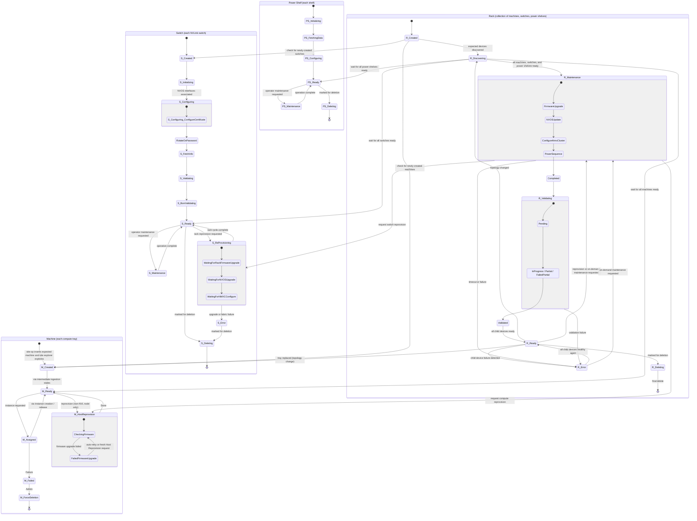
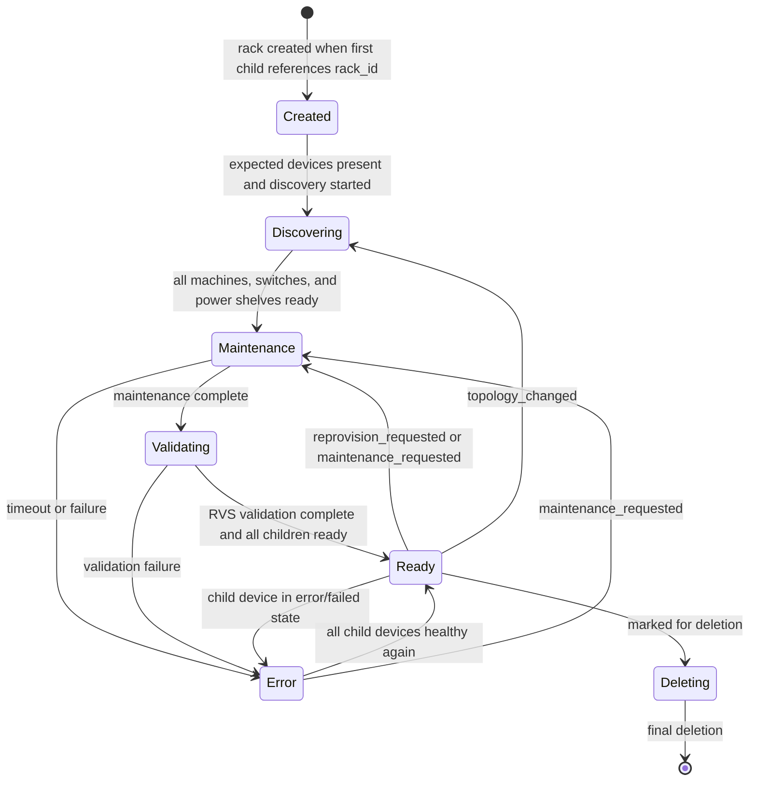

# Rack State Machine interaction with Machine, Switch, and Power Shelf

This document defines the combined state machines for **Machine** (each compute tray / managed host lifecycle), **Switch** (each NVLink switch), **Power Shelf** (each power shelf), and **Rack** (collection of machines, switches, and power shelves). The diagram below shows all four and the transitions between the Rack state machine and the child device state machines.

For switch-only and power-shelf-only diagrams, see [Switch State Diagram](switch.md) and [Power Shelf State Diagram](power_shelf.md). For on-demand rack maintenance API details, see [On-Demand Rack Maintenance](rack.md).

## Combined State Diagram (Machine, Switch, Power Shelf, Rack)



---

## Rack State Machine Flow

The **Rack** state machine represents a collection of machines, switches, and power shelves. The rack lifecycle runs in coordination with child device state machines: the rack tracks when its children are created and ready, drives maintenance (firmware upgrade, NVOS update, NMX cluster configuration, optional power sequencing), validates the rack via RVS, and reaches `Ready` when validation completes and all trays are healthy.

### High-Level Rack Diagram



### Rack State Definitions

#### Created (R_Created)

- **Entry:** Site operator enters the expected rack; Site Explorer creates the rack entity when a machine, switch, or power shelf with the same `rack_id` is discovered.
- **Exit:** When expected devices are present and discovery can proceed, the rack moves to **Discovering**.

#### Discovering (R_Discovering)

- **Entry:** From `Created` when discovery starts. Also re-entered from `Ready` when `topology_changed` is set (tray replacement).
- **Exit:** When every machine in the rack is `ManagedHostState::Ready` or `Assigned`, every switch is `SwitchControllerState::Ready`, and every power shelf is `Ready` per the rack profile capability counts, the rack transitions to **Maintenance** at `FirmwareUpgrade(Start)`.

The rack waits until all child devices reach ready before starting the first maintenance cycle.

#### Maintenance (R_Maintenance)

- **Entry:** From `Discovering` after all children are ready, from `Ready` when `reprovision_requested` or `maintenance_requested` is set, or from `Error` when on-demand maintenance is requested.
- **Exit:**
  - To **Validating** (`Pending`) when maintenance reaches `Completed`.
  - To **Error** on timeout or unrecoverable failure.

**Sub-state flow** (activities may be skipped based on `MaintenanceScope.activities`):

```text
FirmwareUpgrade(Start -> WaitForComplete)
  -> NVOSUpdate(Start -> WaitForComplete)
  -> ConfigureNmxCluster(Start -> ConfigureCertificates -> DisableScaleUpFabricState
                          -> ConfigureScaleUpFabricManager -> WaitForFabricStatus)
  -> PowerSequence (optional)
  -> Completed
  -> Validating(Pending)
```

| Sub-state | Description |
|-----------|-------------|
| **FirmwareUpgrade** | Rack-level RMS firmware upgrade for scoped machines and switches. Sets per-device `firmware_upgrade_status` and drives switch `ReProvisioning::WaitingForRackFirmwareUpgrade` / machine `HostReprovision`. |
| **NVOSUpdate** | NVOS image update for scoped switches. Sets `nvos_update_status` and drives switch `ReProvisioning::WaitingForNVOSUpgrade`. |
| **ConfigureNmxCluster** | NMX cluster setup. Configures mTLS certificates on the primary switch, disables ScaleUpFabric state on scoped switches, configures the primary switch fabric manager, then waits for fabric status. See sub-states below. |
| **PowerSequence** | Optional power-on/off/reset sequencing for scoped devices. |
| **Completed** | All requested maintenance activities finished; rack advances to validation. |

**ConfigureNmxCluster** sub-states:

```text
Start
  -> ConfigureCertificates(Start -> WaitForComplete { jobs })
  -> DisableScaleUpFabricState
  -> ConfigureScaleUpFabricManager
  -> WaitForFabricStatus
```

During `ConfigureCertificates`, the rack configures ScaleUpFabric mTLS services on the primary switch via component manager / RMS. During `WaitForFabricStatus`, the rack polls fabric manager status and persists per-switch `fabric_manager_status` while switches wait in `ReProvisioning::WaitingForNMXCConfigure`.

#### Validating (R_Validating)

- **Entry:** From `Maintenance(Completed)`.
- **Exit:**
  - To **Ready** when validation reaches `Validated` and all child devices are ready.
  - To **Error** on terminal validation failure.

**Sub-states:** `Pending` → `InProgress` → `Partial` / `FailedPartial` → `Validated` or `Failed`. RVS drives transitions by writing `rv.run-id` and partition result labels on rack machines.

#### Ready (R_Ready)

- **Entry:** From `Validating` when validation completes and every tray is healthy.
- **Exit:**
  - To **Maintenance** when `reprovision_requested` or `maintenance_requested` is set.
  - To **Discovering** when `topology_changed` is set (tray replacement).
  - To **Error** when any child switch, power shelf, or machine enters a terminal failure state.

The rack is fully operational. While ready, it monitors child health and accepts reprovisioning or on-demand maintenance requests.

#### Error (R_Error)

- **Entry:** From `Maintenance`, `Validating`, or `Ready` on failure.
- **Exit:**
  - To **Ready** when all child devices are healthy again.
  - To **Maintenance** when on-demand maintenance is requested from error state.

#### Deleting (R_Deleting)

- **Entry:** When the rack is marked `deleted`.
- **Exit:** Terminal delete.

---

## Switch Interaction with Rack

The Rack state machine drives or observes the Switch state machine as follows:

| Rack state | Effect on Switch |
|------------|------------------|
| R_Discovering | Rack waits until all switches are `Ready` before moving to `Maintenance`. |
| R_Maintenance (`FirmwareUpgrade`) | Rack sets `switch_reprovisioning_requested` and `firmware_upgrade_status`; switches enter `ReProvisioning::WaitingForRackFirmwareUpgrade`. |
| R_Maintenance (`NVOSUpdate`) | Rack sets `nvos_update_status`; switches advance to `ReProvisioning::WaitingForNVOSUpgrade`. |
| R_Maintenance (`ConfigureNmxCluster`) | Rack configures primary-switch certificates, fabric manager, and sets `fabric_manager_status`; switches advance to `ReProvisioning::WaitingForNMXCConfigure`. |
| R_Maintenance (any) | If the rack enters `Error`, rack-initiated switch reprovisioning is aborted and switches return to `Ready`. |
| R_Ready | Rack monitors for switches in `Error`; any failed switch can move the rack to `Error`. |

These cross-state dependencies are shown in the [Combined State Diagram](#combined-state-diagram-machine-switch-power-shelf-rack).

### Switch State Machine Flow (summary)

The **Switch** state machine runs on each switch. The lifecycle runs from creation through initialization, certificate configuration, password rotation, slot/tray fetch, validation, BOM validation, and `Ready`. From `Ready` a switch can enter operator `Maintenance`, rack-driven `ReProvisioning`, `Deleting`, or `Error`.

Bring-up flow:

```text
Created -> Initializing -> Configuring -> FetchInfo -> Validating -> BomValidating -> Ready
```

Rack reprovisioning flow (when `continue_after_firmware_upgrade` is true):

```text
Ready -> ReProvisioning(WaitingForRackFirmwareUpgrade
                      -> WaitingForNVOSUpgrade
                      -> WaitingForNMXCConfigure) -> Ready
```

See [Switch State Diagram](switch.md) for the full switch FSM.

---

## Machine Interaction with Rack

The Rack state machine drives or observes the Machine (compute) state machine as follows:

| Rack state | Effect on Machine |
|------------|-------------------|
| R_Created | Rack checks for newly-created compute machines (`ManagedHostState` ingestion states) that belong to this rack. |
| R_Discovering | Rack checks that all compute machines are `Ready` or `Assigned` before moving to `Maintenance`. |
| R_Maintenance | Rack requests compute machine reprovision (`HostReprovision`); tracks when machines return to `Ready`. If a machine is stuck in `HostReprovision::FailedFirmwareUpgrade`, the Rack (or operator) may issue a fresh Host Reprovision request to restart the firmware upgrade flow without waiting for the auto-retry interval. |
| R_Ready | If a tray is replaced, a new machine is created and the rack re-enters `Discovering`. |

These cross-state dependencies are shown in the [Combined State Diagram](#combined-state-diagram-machine-switch-power-shelf-rack).

---

## Power Shelf Interaction with Rack

| Rack state | Effect on Power Shelf |
|------------|-----------------------|
| R_Discovering | Rack waits until all power shelves in the rack profile are `Ready` before moving to `Maintenance`. |
| R_Maintenance | Scoped power shelves may participate in firmware upgrade or power-sequence activities. |
| R_Ready | Rack monitors for power shelves in `Error`; any failed shelf can move the rack to `Error`. |

See [Power Shelf State Diagram](power_shelf.md) for the power-shelf FSM.

---

### Recovering from M_HostReprovision::FailedFirmwareUpgrade

A compute machine that fails its host firmware upgrade lands in the
`M_HostReprovision::FailedFirmwareUpgrade` substate. There are two ways out:

1. **Automatic retry.** While `retry_count < MAX_FIRMWARE_UPGRADE_RETRIES` and the
   configured `host_firmware_upgrade_retry_interval` has elapsed since the
   failure, the machine state handler automatically transitions back to
   `CheckingFirmwareV2` and re-attempts the upgrade.
2. **Fresh Host Reprovision request.** The Rack state machine (or an operator
   via `trigger_host_reprovisioning`) can issue a brand-new Host Reprovision
   request at any time. The new request overwrites
   `host_reprovisioning_requested` with `started_at = None`; the FailedFirmwareUpgrade
   handler detects this fresh request and restarts the upgrade flow from
   `CheckingFirmwareV2` with `retry_count` reset to `0`, mirroring the way
   `ManagedHostState::Ready` kicks off a Host Reprovision (including the
   `host-fw-update` health-report alert merge). Rack-level requests (initiator
   prefixed with `rack-`) instead enter `WaitingForRackFirmwareUpgrade`.

This guarantees the Rack can always drive a stuck compute out of
`FailedFirmwareUpgrade` without waiting for the retry backoff, which is
important during `R_Maintenance` where the Rack must converge all computes back
to `M_Ready` before progressing to `R_Validation`.

### Tray Replacement (External Event)

When a tray (compute machine) in a rack is physically replaced, the rack topology changes. This is an external event that triggers the following state machine transitions:

1. **Old machine:** The replaced machine is removed from the rack. Its Machine state machine terminates (deletion path).
2. **New machine:** Site Explorer detects the new tray and creates a new machine entity in **M_Created**. The new machine progresses through its ingestion states toward **M_Ready**.
3. **Rack:** The rack detects the topology change (`topology_changed`) and transitions from **R_Ready** → **R_Discovering**. In R_Discovering the rack waits until the new machine reaches **M_Ready** (and all other machines, switches, and power shelves remain ready), then proceeds through **R_Maintenance** → **R_Validation** → **R_Ready** as in the normal flow.

This ensures that any replaced hardware is fully discovered, provisioned, and validated before the rack returns to an operational ready state.

### How the data is organized

A **rack** is the top-level entity. Every **machine** (compute tray), every **switch**, and every **power shelf** belongs to exactly one rack.

- Each rack has a unique identifier (the rack ID).
- Each child device stores the rack ID of the rack it belongs to.
- Each switch has `switch_reprovisioning_requested` and per-cycle status fields (`firmware_upgrade_status`, `nvos_update_status`, `fabric_manager_status`) that the rack state machine sets during maintenance.

When a site operator enters an expected rack (with a rack ID and rack type), Site Explorer creates the rack entity as soon as it discovers machines, switches, or power shelves that share the same rack ID. From that point the rack tracks its children through their respective state machines until the entire rack reaches a ready state.

## Implementation

- **Rack state type**: `RackState` in `crates/api-model/src/rack.rs`.
- **Rack handlers**: `crates/rack-controller/src/`.
- **Switch state type**: `SwitchControllerState` in `crates/api-model/src/switch/mod.rs`.
- **Switch handlers**: `crates/switch-controller/src/`.
- **On-demand maintenance API**: [On-Demand Rack Maintenance](rack.md).
