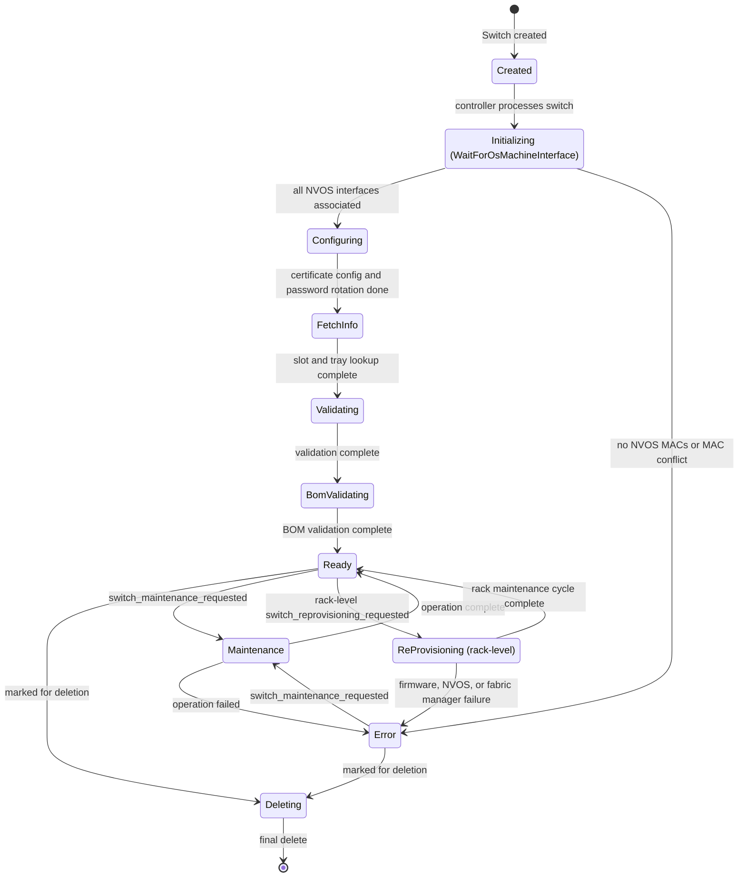

# Switch State Diagram

This document describes the Finite State Machine (FSM) for Switches in NICo: lifecycle from creation through configuration, validation, ready, optional rack-level reprovisioning, operator maintenance, and deletion.

## High-Level Overview

The main flow shows the primary states and transitions:



## States

| State | Description |
|-------|-------------|
| **Created** | Switch record exists in NICo; awaiting first controller tick. |
| **Initializing** | Controller waits for expected switch NVOS MAC associations. Sub-state: `WaitForOsMachineInterface`. |
| **Configuring** | Switch is being configured. Sub-states: `ConfigureCertificate` (`Start` → `WaitForComplete { job_id }`), then `RotateOsPassword`. See [Switch Certificate Configuration](switch_configure_certificate.md). |
| **FetchInfo** | Controller fetches rack placement info (slot and tray) from the component manager backend and persists it on the switch record. Warn-and-continue on lookup failure. |
| **Validating** | Switch is being validated. Sub-state: `ValidationComplete`. |
| **BomValidating** | BOM (Bill of Materials) validation. Sub-state: `BomValidationComplete`. |
| **Ready** | Switch is ready for use. Can be deleted, enter operator maintenance, or enter rack-level reprovisioning. |
| **Maintenance** | Operator-requested maintenance in progress. Operation is carried in `operation`: `PowerOn`, `PowerOff`, `Reset`, or `ReconfigureCertificate`. Certificate reconfiguration uses `configure_certificate` sub-states (`Start` → `WaitForComplete { job_id }`). |
| **ReProvisioning** | Rack-driven maintenance in progress. Sub-states: `WaitingForRackFirmwareUpgrade`, `WaitingForNVOSUpgrade`, `WaitingForNMXCConfigure`. The rack state machine sets per-switch status fields and clears `switch_reprovisioning_requested` when the cycle completes. |
| **Error** | Switch is in error (for example firmware upgrade failed, certificate job failed, or NVOS MAC conflict). Can transition to `Deleting` or `Maintenance`; otherwise waits for manual intervention. |
| **Deleting** | Switch is being removed; ends in final delete (terminal). |

## Transitions (by trigger)

| From | To | Trigger / Condition |
|------|-----|----------------------|
| *(create)* | Created | Switch created |
| Created | Initializing (`WaitForOsMachineInterface`) | Controller processes switch |
| Initializing (`WaitForOsMachineInterface`) | Configuring (`ConfigureCertificate` `Start`) | All NVOS interfaces associated for expected switch |
| Initializing (`WaitForOsMachineInterface`) | Error | Expected switch has empty `nvos_mac_addresses` or MAC owned by another switch |
| Configuring (`ConfigureCertificate` `Start`) | Configuring (`ConfigureCertificate` `WaitForComplete`) | Component manager returns RMS job ID (`domain_name` = `rack_id`) |
| Configuring (`ConfigureCertificate` `Start`) | Configuring (`RotateOsPassword`) | No `rack_id` or no component manager (skip certificate step) |
| Configuring (`ConfigureCertificate` `WaitForComplete`) | Configuring (`RotateOsPassword`) | RMS job `Completed` |
| Configuring (`ConfigureCertificate` `WaitForComplete`) | Error | RMS job `Failed` |
| Configuring (`RotateOsPassword`) | FetchInfo | NVOS credentials stored or already in Vault |
| Configuring (`RotateOsPassword`) | Error | No expected switch or missing BMC MAC |
| FetchInfo | Validating (`ValidationComplete`) | Slot/tray lookup attempted (always advances) |
| Validating (`ValidationComplete`) | BomValidating (`BomValidationComplete`) | Validation complete |
| BomValidating (`BomValidationComplete`) | Ready | BOM validation complete |
| Ready | Deleting | `deleted` set (marked for deletion) |
| Ready | Maintenance | `switch_maintenance_requested` is set |
| Ready | ReProvisioning (`WaitingForRackFirmwareUpgrade`) | `switch_reprovisioning_requested` with `initiator` prefixed `rack-` |
| Ready | Error | Unknown `switch_reprovisioning_requested` initiator |
| Maintenance (`PowerOn` / `PowerOff` / `Reset`) | Ready | BMC operation complete; maintenance request cleared |
| Maintenance (`PowerOn` / `PowerOff` / `Reset`) | Error | BMC operation failed |
| Maintenance (`ReconfigureCertificate` `Start`) | Maintenance (`ReconfigureCertificate` `WaitForComplete`) | Component manager returns RMS job ID |
| Maintenance (`ReconfigureCertificate` `WaitForComplete`) | Ready | RMS job `Completed`; maintenance request cleared |
| Maintenance (`ReconfigureCertificate` `WaitForComplete`) | Error | RMS job `Failed` |
| ReProvisioning (`WaitingForRackFirmwareUpgrade`) | ReProvisioning (`WaitingForNVOSUpgrade`) | `firmware_upgrade_status` terminal `Completed` and `continue_after_firmware_upgrade` is true |
| ReProvisioning (`WaitingForRackFirmwareUpgrade`) | Ready | `firmware_upgrade_status` terminal `Completed` and `continue_after_firmware_upgrade` is false |
| ReProvisioning (`WaitingForRackFirmwareUpgrade`) | Error | `firmware_upgrade_status` terminal `Failed` |
| ReProvisioning (`WaitingForNVOSUpgrade`) | ReProvisioning (`WaitingForNMXCConfigure`) | `nvos_update_status` terminal `Completed` |
| ReProvisioning (`WaitingForNVOSUpgrade`) | Error | `nvos_update_status` terminal `Failed` |
| ReProvisioning (`WaitingForNMXCConfigure`) | Ready | `fabric_manager_status` reports running |
| ReProvisioning (`WaitingForNMXCConfigure`) | Error | `fabric_manager_status` reports an error message |
| ReProvisioning (any sub-state) | Ready | Parent rack entered `Error`; rack-level reprovision request cleared |
| Error | Deleting | `deleted` set (marked for deletion) |
| Error | Maintenance | `switch_maintenance_requested` is set |
| Deleting | *(end)* | Final delete committed |

## Rack-Level Re-Provisioning

Rack maintenance drives switch reprovisioning by setting `switch_reprovisioning_requested` with an initiator prefixed `rack-`. The switch controller then walks these sub-states in order when `continue_after_firmware_upgrade` is true (the default):

```text
WaitingForRackFirmwareUpgrade -> WaitingForNVOSUpgrade -> WaitingForNMXCConfigure -> Ready
```

The rack state machine updates per-switch `firmware_upgrade_status`, `nvos_update_status`, and `fabric_manager_status` while the switch waits in each sub-state. If the parent rack enters `Error`, the switch aborts reprovisioning and returns to `Ready`.

## On-Demand Maintenance Operations

The `Maintenance` state is entered when `switch_maintenance_requested` is posted (from `Ready` or `Error`). Supported operations:

- **PowerOn** — powers the switch on via the component manager.
- **PowerOff** — powers the switch off.
- **Reset** — force-restarts the switch.
- **ReconfigureCertificate** — reinstalls or rotates NVOS mTLS certificates via component manager / RMS. Uses the same async certificate flow as bring-up; see [Switch Certificate Configuration](switch_configure_certificate.md).

## Implementation

- **State type**: `SwitchControllerState` in `crates/api-model/src/switch/mod.rs`.
- **Handlers**: `crates/switch-controller/src/` — one module per top-level state (`created`, `initializing`, `configuring`, `fetch_info`, `validating`, `bom_validating`, `ready`, `maintenance`, `reprovisioning`, `error_state`, `deleting`).
- **Certificate configuration design**: [switch_configure_certificate.md](switch_configure_certificate.md).
- **Orchestration**: `SwitchStateHandler` in `handler.rs` delegates to the handler for the current `controller_state`.
