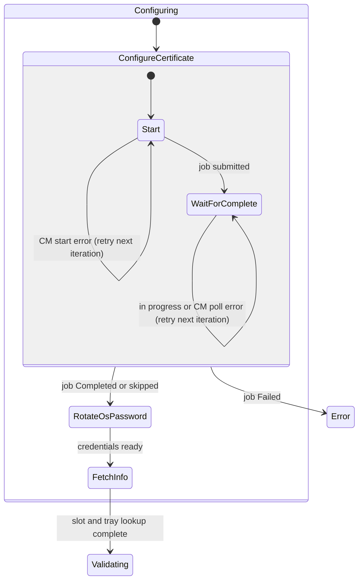
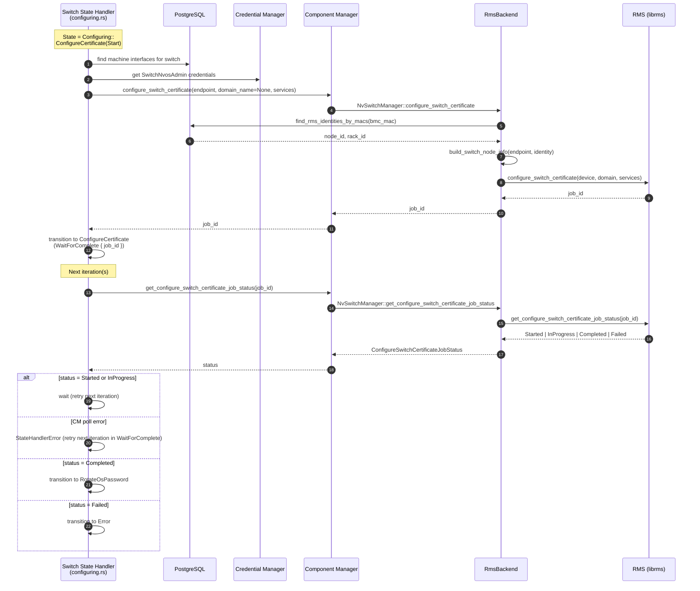
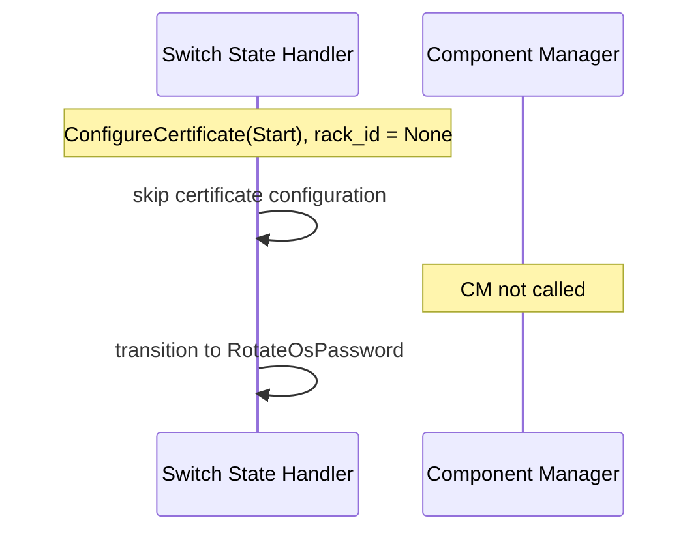
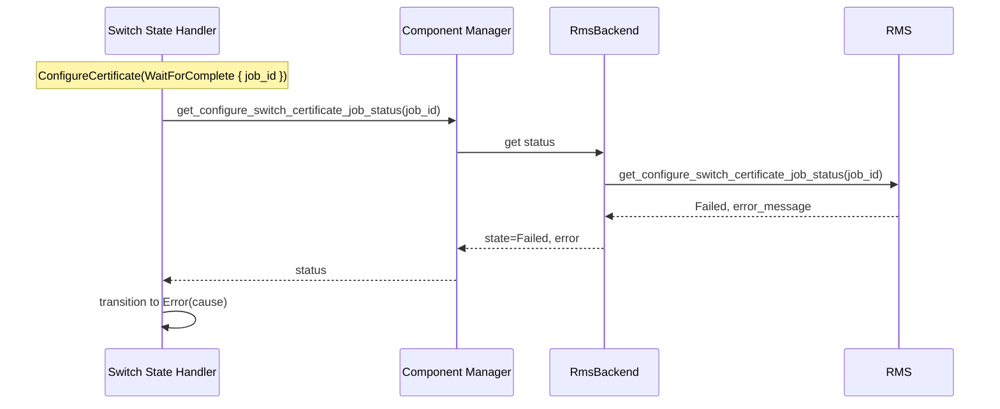

# Switch Certificate Configuration (ConfigureCertificate)

This document describes how the switch state controller configures switch TLS
certificates during the **Configuring** phase. The handler delegates device
operations to **Component Manager (CM)**, which in turn calls **Rack Manager
Service (RMS)** asynchronously and polls job status until completion.

## Goals

- Install or rotate the switch NVOS certificate as part of initial switch
  bring-up, before NVOS admin credentials are stored (`RotateOsPassword`).
- Keep RMS-specific protobuf and job semantics behind the CM `NvSwitchManager`
  abstraction so the state handler stays backend-agnostic (RMS, NSM, mock).
- Persist the async **job ID** in controller state so restarts can resume polling.

## Placement in the Switch FSM

`ConfigureCertificate` is a sub-state of `SwitchControllerState::Configuring`,
before `RotateOsPassword`, `FetchInfo`, and `Validating`.



Transient CM or transport failures during `Start` or `WaitForComplete` return
`StateHandlerError` and leave the switch in the same sub-state for retry on the
next handler iteration. Only a terminal RMS job status of `Failed` (or missing
component manager while polling) transitions to `Error`.

### Sub-states (`ConfigureCertificateState`)

| Sub-state | Purpose |
|-----------|---------|
| `Start` | Resolve switch endpoint, derive `domain_name`, call CM to start RMS job. |
| `WaitForComplete { job_id }` | Poll CM → RMS for job status until terminal. |

Job status values use `ConfigureSwitchCertificateState`: `Started`,
`InProgress`, `Completed`, `Failed`.

## Domain name (`domain_name`) and mTLS services

The switch state handler passes:

- `domain_name = None` for both bring-up and maintenance reconfiguration.
  RMS receives an unset `domain` field; rack association is enforced separately
  when deciding whether certificate configuration can run.
- `services` from `SwitchStateHandlerServices.switch_mtls_services`, sourced
  from `[switch_state_controller].switch_mtls_services` in site config. When
  omitted or empty, all supported switch mTLS services are used.

| Condition | Behavior |
|-----------|----------|
| `rack_id` is `None` | Bring-up skips certificate configuration and advances to `RotateOsPassword`. Maintenance `ReconfigureCertificate` transitions to `Error`. |
| Component manager not configured | Bring-up skips certificate configuration. Maintenance `ReconfigureCertificate` transitions to `Error`. |
| `bmc_mac_address` is `None` | Transition to `Error`. |
| Missing NVOS MAC/IP, vault credentials, or endpoint row | Transition to `Error` with a descriptive cause (no `0.0.0.0` placeholder). |
| CM returns error on `configure_switch_certificate` | `StateHandlerError`; remain in `Start` and retry on the next iteration. |
| CM returns error on `get_configure_switch_certificate_job_status` | `StateHandlerError`; remain in `WaitForComplete` and retry on the next iteration. |
| RMS job status is `Started` or `InProgress` | Wait; poll again on the next iteration. |
| RMS job status is `Failed` | Transition to `Error` with the job error message. |
| Component manager not configured while polling | Transition to `Error` (no job ID to resume). |

Rack NMX cluster maintenance uses a separate service list:
`[rack_state_controller].nmx_cluster_switch_mtls_services` (defaults to
ScaleUpFabric manager and telemetry interface services). See
[Rack State Machine](rackstatemachine.md).

## Component Manager API

CM exposes two methods used by the switch configuration handler:

| Method | Input | Output |
|--------|-------|--------|
| `configure_switch_certificate` | `SwitchEndpoint`, `domain_name: Option<&str>`, `services: Option<&[i32]>` | `job_id: String` |
| `get_configure_switch_certificate_job_status` | `job_id: &str` | `ConfigureSwitchCertificateJobStatus { state, error }` |

`SwitchEndpoint` is built from:

- Switch BMC MAC and BMC IP (required)
- Associated NVOS machine interface MAC and IP (both required; matches power-control validation in `maintenance.rs`)
- NVOS admin credentials from the credential vault (`SwitchNvosAdmin`); endpoint
  resolution failures during `Start` transition to `Error` (they do not return
  `StateHandlerError`).

### Backend matrix

| Backend | `configure_switch_certificate` | `get_configure_switch_certificate_job_status` |
|---------|--------------------------------|-----------------------------------------------|
| **RMS** (`RmsBackend`) | Resolve RMS node identity from DB; call RMS `configure_switch_certificate`. | Poll RMS job status and map RMS states to `ConfigureSwitchCertificateState`. |
| **Mock** | Returns a mock job ID. | Returns configured mock status. |
| **NSM** | `InvalidArgument` (not supported). | `InvalidArgument` (not supported). |

## RMS integration

### Identity resolution (RMS backend only)

Before calling RMS, `RmsBackend`:

1. Looks up `switch.id` and `switch.rack_id` via `find_rms_identities_by_macs`.
2. Builds `rms::NodeInfo` from the `SwitchEndpoint` and resolved identity.
3. Passes optional `domain`, `services`, and device info to RMS.

If the switch has no `rack_id` in the database, identity resolution fails and CM
returns an internal error (the state handler normally skips earlier when
`switch.rack_id` is unset during bring-up).

### RMS RPCs

| RPC | Request (conceptual) | Response (conceptual) |
|-----|----------------------|-----------------------|
| `configure_switch_certificate` | Device (`NodeInfo`), optional `domain`, `services[]` | per-node `job_id`, batch status |
| `get_configure_switch_certificate_job_status` | `job_id` | RMS job state (`queued`, `running`, `completed`, `failed`, ...) |

RMS job states are mapped in `map_rms_configure_switch_certificate_job_state`.

## Sequence diagrams

### Happy path (RMS backend)

One state-controller iteration runs `Start`; a later iteration runs
`WaitForComplete` until RMS reports completion.



### Skip path (no rack association)



### Error path (job failed)



## Maintenance reconfiguration (`ReconfigureCertificate`)

Operator maintenance can reinstall switch certificates without leaving `Ready`
permanently. The flow reuses `certificate.rs` with
`ConfigureSwitchCertificateMode::Reconfigure`:

```text
Ready
  -> Maintenance { operation: ReconfigureCertificate, configure_certificate: Start }
  -> Maintenance { ..., configure_certificate: WaitForComplete { job_id } }
  -> Ready (success, maintenance request cleared)
  -> Error (failure)
```

Differences from bring-up:

| Aspect | Bring-up (`Configuring`) | Maintenance (`ReconfigureCertificate`) |
|--------|--------------------------|----------------------------------------|
| Missing `rack_id` | Skip to `RotateOsPassword` | `Error` |
| Missing component manager | Skip to `RotateOsPassword` | `Error` |
| Transient CM or transport error | `StateHandlerError`; retry in current sub-state | Same retry contract |
| Terminal job `Failed` | `Error` | `Error` (maintenance request cleared) |
| Success next state | `RotateOsPassword` | `Ready` |

Entry point: `switch_maintenance_requested.operation = ReconfigureCertificate`
from `Ready` or `Error`. See [Switch State Diagram](switch.md).

## Persistence

Controller state is stored in `switches.controller_state` (JSON). Example
after job submission:

```json
{
  "state": "configuring",
  "config_state": {
    "ConfigureCertificate": {
      "configure_certificate": {
        "WaitForComplete": {
          "job_id": "stub-switch-cert-job"
        }
      }
    }
  }
}
```

The job ID is **only** in controller state (unlike rack firmware upgrade, which
also stores a separate `firmware_upgrade_job` row). This is sufficient for a
single-switch, single-job certificate operation.

## Implementation map

| Layer | Location |
|-------|----------|
| State types | `crates/api-model/src/switch/mod.rs` — `ConfigureCertificateState`, `ConfiguringState` |
| Job status enum | `crates/api-model/src/component_manager.rs` — `ConfigureSwitchCertificateState` |
| Shared certificate logic | `crates/switch-controller/src/certificate.rs` |
| Bring-up handler | `crates/switch-controller/src/configuring.rs` |
| Maintenance handler | `crates/switch-controller/src/maintenance.rs` |
| Rack NMX cluster certificates | `crates/rack-controller/src/nmx_certificate.rs` |
| CM facade | `crates/component-manager/src/component_manager.rs` |
| CM trait | `crates/component-manager/src/nv_switch_manager.rs` |
| RMS backend | `crates/component-manager/src/rms.rs` |
| Tests | `crates/api-core/src/tests/switch_state_controller/` |

## Testing

Integration tests cover:

- Skip when `rack_id` or component manager is absent → `RotateOsPassword`
- `Start` → `WaitForComplete` with mock CM
- `WaitForComplete` → `RotateOsPassword` on success
- `WaitForComplete` → `Error` on failed job status
- `ConfigureCertificate` (completed or skipped) → `RotateOsPassword` → `FetchInfo` → `Validating`
- Maintenance `ReconfigureCertificate` success and failure paths

Run with `DATABASE_URL` set (sqlx test harness), filter:
`cargo test -p carbide-api-core configure_certificate`.

## Future work

1. Decide whether `domain` should be set explicitly (for example to `rack_id`)
   once the RMS certificate catalog contract is finalized.
2. Decide whether NSM backend should support certificate configuration or remain
   explicitly unsupported.
