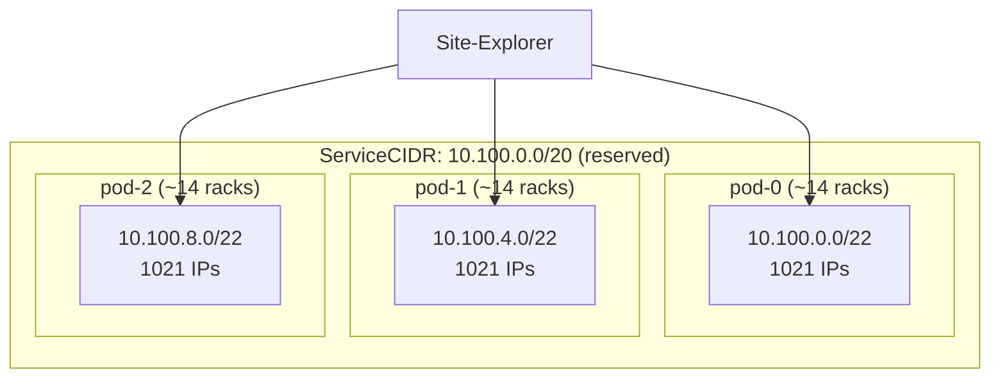

# Machine-A-Tron Helm Chart

Helm chart for deploying Machine-A-Tron - a mock machine simulator for NICo testing.

## Overview

Machine-A-Tron creates simulated bare-metal machines that behave like real hosts, allowing you to:

- Test NICo without physical hardware
- Simulate multiple hosts, DPUs, switches and power shelves
- Perform load testing at scale (multiple pods, thousands of BMCs)
- Run simulations alongside real hardware

## Deployment Modes

| Mode | Use Case | Real HW Compatible | Network Setup |
|------|----------|--------------------|---------------|
| **Override Mode** | Development | No | Simple - single endpoint |
| **ClusterIP Mode** | Scale testing | Yes | Per-BMC ClusterIP services |

---

## Mode 1: Override Mode (Development)

**Use for development environments where only simulated machines are needed.**

NICo's Site-Explorer is configured to redirect ALL Redfish calls to machine-a-tron.
Simple but **incompatible with real hardware**.

### Setup

```bash
helm upgrade --install nico ./helm \
  --namespace nico-mat \
  --set nico-machine-a-tron.enabled=true \
  --set nico-machine-a-tron.pods.default.machines.rack-machines.hostCount=10 \
  --set nico-machine-a-tron.pods.default.machines.rack-machines.dpuPerHostCount=2
```

**NICo Site Config:**

[site_explorer]
override_target_host = "nico-machine-a-tron-bmc-mock"
override_target_port = 1266
```

---

## Mode 2: ClusterIP Mode (Scale Testing)

**Use for load testing environments where simulated machines run alongside real hardware.**

Each simulated BMC gets a dedicated ClusterIP service. Supports multi-pod deployments.

### Architecture



### Prerequisites

- **Kubernetes 1.29+** (ServiceCIDR API support)
- IP range within cluster's default service CIDR (e.g., `10.96.0.0/12`)

### Single Pod Setup

```yaml
# values.yaml
bmcServices:
  enabled: true
  serviceCIDR:
    create: true

pods:
  default:
    cidr: "10.100.0.0/22"  # 1021 IPs for ~14 racks
    machines:
      compute:
        hwType: wiwynn_gb200_nvl
        hostCount: 252      # 18 trays × 14 racks
        dpuPerHostCount: 2  # 2 BF3 per tray → 504 DPU BMCs
        oobDhcpRelayAddress: "10.100.0.1"
      switches:
        hwType: nvidia_switch_nd5200_ld
        hostCount: 126      # 9 switches × 14 racks
        dpuPerHostCount: 0
        oobDhcpRelayAddress: "10.100.0.1"
      power:
        hwType: liteon_power_shelf
        hostCount: 112      # 8 shelves × 14 racks
        dpuPerHostCount: 0
        oobDhcpRelayAddress: "10.100.0.1"
```

**Total BMCs:** 252 + 504 + 126 + 112 = **994 BMCs** (fits in /22)

### Multi-Pod Setup (Large Scale)

For deployments exceeding 1021 BMCs, use multiple pods with separate CIDRs:

```yaml
# values.yaml
bmcServices:
  enabled: true
  serviceCIDR:
    create: true
    cidr: "10.100.0.0/20"  # Covers all pods

pods:
  pod-0:
    cidr: "10.100.0.0/22"
    machines:
      compute:
        hwType: wiwynn_gb200_nvl
        hostCount: 252
        dpuPerHostCount: 2
        oobDhcpRelayAddress: "10.100.0.1"
      switches:
        hwType: nvidia_switch_nd5200_ld
        hostCount: 126
        oobDhcpRelayAddress: "10.100.0.1"
      power:
        hwType: liteon_power_shelf
        hostCount: 112
        oobDhcpRelayAddress: "10.100.0.1"

  pod-1:
    cidr: "10.100.4.0/22"
    machines:
      compute:
        hwType: wiwynn_gb200_nvl
        hostCount: 252
        dpuPerHostCount: 2
        oobDhcpRelayAddress: "10.100.4.1"
      switches:
        hwType: nvidia_switch_nd5200_ld
        hostCount: 126
        oobDhcpRelayAddress: "10.100.4.1"
      power:
        hwType: liteon_power_shelf
        hostCount: 112
        oobDhcpRelayAddress: "10.100.4.1"

  pod-2:
    cidr: "10.100.8.0/22"
    machines:
      # ... same pattern
```

### What Gets Created

**Per pod:**
| Resource | Name Pattern |
|----------|--------------|
| Deployment | `nico-machine-a-tron-pod-0` |
| ConfigMap | `nico-machine-a-tron-pod-0-config-files` |
| Certificate | `nico-machine-a-tron-pod-0-certificate` |
| Service | `nico-machine-a-tron-pod-0-bmc-mock` |

**Per BMC:**
| Resource | Name Pattern |
|----------|--------------|
| ClusterIP Service | `nico-machine-a-tron-bmc-10-100-0-2` |

**Cluster-scoped:**
| Resource | Name |
|----------|------|
| ServiceCIDR | `nico-machine-a-tron-bmc-cidr` |

### Scale Guidelines

**BMC count per GB200 NVL72 rack:**
| Component | Count | BMCs per Unit | Total |
|-----------|-------|---------------|-------|
| Compute trays | 18 | 3 (1 tray + 2 BF3) | 54 |
| NVLink switches | 9 | 1 | 9 |
| Power shelves | 8 | 1 | 8 |
| **Total per rack** | | | **71** |

**CIDR sizing:**
| CIDR | Usable IPs | Racks per Pod |
|------|------------|---------------|
| /24 | 253 | ~3 |
| /23 | 509 | ~7 |
| /22 | 1021 | ~14 |
| /21 | 2045 | ~28 |

### NICo Configuration

**DO NOT set `override_target_host`** - let NICo connect to actual BMC IPs:

```toml
[site_explorer]
enabled = true
create_machines = true
# override_target_host = ...  # DO NOT SET
```

**Network config per pod:**

[networks.pod-0-oob]
type = "underlay"
prefix = "10.100.0.0/22"
gateway = "10.100.0.1"

[networks.pod-1-oob]
type = "underlay"
prefix = "10.100.4.0/22"
gateway = "10.100.4.1"
```

---

## Configuration Reference

### Pod Configuration

```yaml
pods:
  <pod-name>:
    cidr: ""  # Required for bmcServices mode
    machines:
      <group-name>:
        hwType: wiwynn_gb200_nvl
        hostCount: 10
        dpuPerHostCount: 2
        oobDhcpRelayAddress: "10.100.0.1"
        adminDhcpRelayAddress: "192.168.176.1"
        # ... other machine settings
```

### BMC Services Configuration

```yaml
bmcServices:
  enabled: false
  servicePort: 443  # External HTTPS port
  serviceCIDR:
    create: true
    name: ""        # Defaults to <release>-bmc-cidr
    cidr: ""        # Auto-detected for single pod, required for multi-pod
```

### Supported Hardware Types

| Type | Description |
|------|-------------|
| `supermicro_gb300_nvl` | Supermicro GB300 NVL |
| `nvidia_dgx_gb300` | NVIDIA DGX GB300 |
| `nvidia_dgx_h100` | NVIDIA DGX H100 |
| `wiwynn_gb200_nvl` | Wiwynn GB200 NVL |
| `lenovo_gb300_nvl` | Lenovo GB300 NVL |
| `dell_poweredge_r750` | Dell PowerEdge R750 |
| `liteon_power_shelf` | Liteon Power Shelf |
| `nvidia_switch_nd5200_ld` | NVIDIA ND5200 Switch |
| `generic_ami` | Generic AMI BMC |
| `generic_supermicro` | Generic Supermicro BMC |

---

## Troubleshooting

### ServiceCIDR Not Ready

```bash
kubectl get servicecidr -o wide
```

Causes:

- CIDR outside cluster's default service CIDR
- Kubernetes version < 1.29

### Service IP Allocation Failed

```bash
kubectl -n nico-mat describe svc nico-machine-a-tron-bmc-10-100-0-2
```

Causes:

- IP already in use
- ServiceCIDR not ready

### Pod Not Receiving Traffic

Verify selector labels match:

# Check service selector
kubectl -n nico-mat get svc nico-machine-a-tron-bmc-10-100-0-2 -o jsonpath='{.spec.selector}'

# Check pod labels
kubectl -n nico-mat get pods -l nvidia-infra-controller/pod-name=pod-0 --show-labels
```

### View Generated Config

```bash
kubectl -n nico-mat get cm nico-machine-a-tron-pod-0-config-files -o yaml
```
